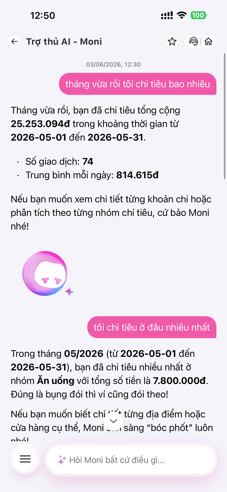
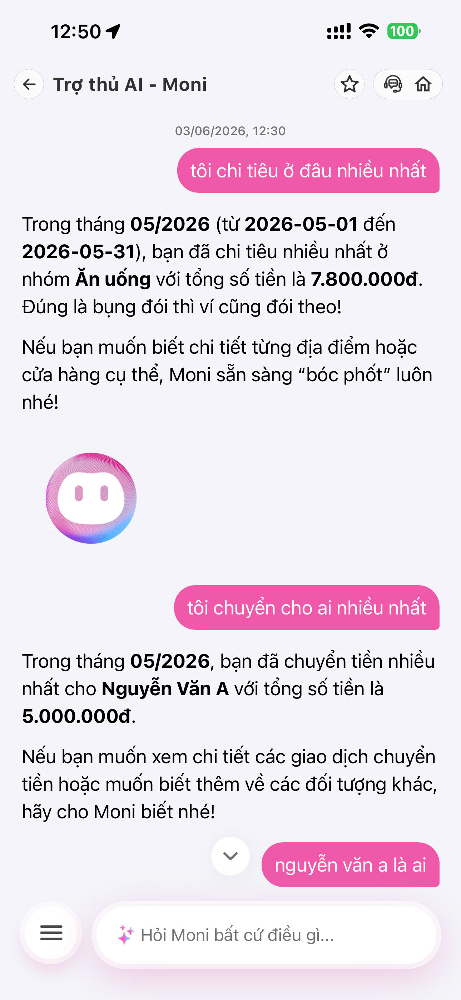

# Workshop — Mổ App AI Thật

**Thời gian:** 35-45 phút  
**Hình thức:** cá nhân trước, chia sẻ theo nhóm sau  
**Output:** finding note + sketch `as-is / to-be`

Mục tiêu không phải chấm "UI đẹp hay xấu". Mục tiêu là dùng sản phẩm thật như một bài needfinding: tìm chỗ product gãy trong workflow thật, rồi viết finding đó thành quyết định product.

## 1. Chọn một sản phẩm để dùng thử

| Sản phẩm | AI feature | Cách truy cập |
|---|---|---|
| MoMo — Moni | Trợ thủ tài chính, phân tích chi tiêu, chatbot | App MoMo |
| Vietnam Airlines — NEO | Chatbot hỗ trợ vé, hành lý, khiếu nại | Website/Zalo VNA |
| V-App — V-AI | Trợ lý voice/text, gợi ý theo ngữ cảnh | App V-App |

## 2. Dùng thử: promise vs reality

Ghi nhanh:

- Product hứa gì?
- User nào được hứa sẽ được giúp?
- Bạn kỳ vọng AI làm được task nào?
- Khi dùng thật, điểm gãy xuất hiện ở đâu?

Evidence cần có:

- screenshot,
- quote từ app/web/review,
- prompt/input đã thử,
- hành vi quan sát được.

## 3. Vẽ 4 paths

| Path | Câu hỏi cần trả lời |
|---|---|
| Happy | Khi AI đúng và tự tin, user thấy gì? |
| Low-confidence | Khi AI không chắc, hệ thống có hỏi lại, show options hoặc chuyển người không? |
| Failure | Khi AI sai, user biết bằng cách nào và sửa thế nào? |
| Correction | Khi user sửa, correction có được lưu/log/học lại không hay biến mất? |

## 4. Viết finding thành quyết định

Không viết:

```text
Bot ngu, trả lời sai.
```

Viết:

```text
Khi user [trigger],
AI/product [failure],
hậu quả là [impact].
Lỗi thuộc layer [promise / intent / data-tool / safety / UX recovery].
Nên sửa bằng [requirement / UX / fallback / human role / test case].
```

Ví dụ:

```text
Khi user hỏi "chi tiêu linh tinh là gì?",
AI hiểu như keyword thay vì nhận ra intent mơ hồ,
hậu quả là user không biết sửa phân loại chi tiêu ở đâu.
Lỗi thuộc Intent + UX Recovery.
Nên sửa bằng low-confidence path: hỏi lại tiêu chí hoặc đưa 2-3 nhóm giao dịch để chọn.
```

## 5. Sketch as-is / to-be

Vẽ 2 cột:

- **As-is:** flow hiện tại, đánh dấu điểm gãy.
- **To-be:** flow đề xuất, đánh dấu path đã sửa.

Không cần đẹp. Cần nhìn vào là hiểu:

- user làm gì,
- AI làm gì,
- lúc AI không chắc thì sao,
- lúc AI sai user recover thế nào.

## 6. Tự kiểm trước khi nộp

- [ ] Có ít nhất 1 screenshot hoặc observation cụ thể.
- [ ] Có đủ 4 paths hoặc nói rõ path nào chưa có trong product.
- [ ] Finding được viết thành product decision, không chỉ là nhận xét.
- [ ] Sketch có as-is và to-be.
- [ ] Có một câu nói rõ finding này sẽ đổi gì trong SPEC.

---

## Đáp án tham khảo: Moni

### 1. Product đã chọn

- MoMo - Moni

### 2. Promise vs reality

**Product hứa gì**

- Moni là trợ thủ AI giúp người dùng xem chi tiêu, phân tích giao dịch, tìm nơi tiêu tiền nhiều nhất, và hỏi về chuyển tiền/giao dịch.

**User nào được hứa sẽ được giúp**

- Người dùng MoMo muốn hiểu tiền của mình đi đâu.
- Người dùng muốn tra nhanh chi tiêu theo tháng, theo nhóm, theo người nhận.

**AI được kỳ vọng làm gì**

- Trả lời câu hỏi về tổng chi tiêu theo thời gian.
- Chỉ ra nhóm chi tiêu lớn nhất.
- Trả lời câu hỏi về người nhận tiền nhiều nhất.
- Nếu user hỏi tiếp, AI nên giải thích rõ dữ liệu đang dựa trên gì.

**Điểm gãy quan sát được**

- Moni trả lời khá tốt các câu hỏi như “tháng vừa rồi tôi chi tiêu bao nhiêu” và “tôi chi tiêu ở đâu nhiều nhất”.
- Với follow-up “nguyễn văn a là ai”, Moni không giải thích được danh tính theo đúng ý người dùng.
- Hệ thống chỉ lặp lại số liệu chuyển tiền nhiều nhất, nhưng không làm rõ đây là người nhận nào trong ngữ cảnh người dùng đang hỏi.

### 3. Evidence từ 2 ảnh

- Ảnh 1:



- Ảnh 1: Moni trả lời tổng chi tiêu tháng 05/2026 là `25.253.094đ`, số giao dịch là `74`, trung bình mỗi ngày là `814.615đ`.
- Ảnh 1: Moni trả lời nhóm chi tiêu nhiều nhất là `Ăn uống` với `7.800.000đ`.
- Ảnh 2:



- Ảnh 2: Moni trả lời người nhận chuyển tiền nhiều nhất là `Nguyễn Văn A` với tổng số tiền `5.000.000đ`.
- Ảnh 2: Khi user hỏi tiếp `nguyễn văn a là ai`, hệ thống không làm rõ danh tính hoặc hỏi lại để xác nhận intent.

### 4. 4 paths

| Path | Quan sát |
|---|---|
| Happy | Khi hỏi “tháng vừa rồi tôi chi tiêu bao nhiêu”, Moni trả lời rõ tổng tiền, khoảng thời gian, số giao dịch và trung bình mỗi ngày. Khi hỏi “tôi chi tiêu ở đâu nhiều nhất”, Moni trả lời đúng nhóm `Ăn uống` và số tiền. |
| Low-confidence | Chưa thấy Moni chủ động hỏi lại hoặc đưa lựa chọn khi user hỏi kiểu mơ hồ như “nguyễn văn a là ai”. |
| Failure | Với câu hỏi về danh tính, Moni trả lời theo hướng thống kê giao dịch chứ không giải thích “Nguyễn Văn A” là ai. |
| Correction | Chưa thấy path để user sửa hoặc yêu cầu giải thích thêm theo dạng “đây là ai trong danh bạ / trong giao dịch / ngoài đời”. |

### 5. Finding thành quyết định

**Finding**

- Khi user hỏi “nguyễn văn a là ai”, Moni hiểu câu hỏi như truy vấn giao dịch thay vì truy vấn danh tính.
- Hậu quả là user nhận được một con số chuyển tiền, nhưng không biết Nguyễn Văn A là ai, dữ liệu đó đến từ đâu, và có thể kiểm tra lại bằng cách nào.
- Lỗi thuộc layer `intent` + `UX recovery`.
- Nên sửa bằng low-confidence path: hỏi lại user đang muốn biết “tên người nhận trong giao dịch”, “thông tin contact”, hay “chi tiết một lần chuyển tiền cụ thể”; đồng thời cho phép bấm vào người nhận để xem danh sách giao dịch liên quan.

**Viết theo format workshop**

```text
Khi user hỏi “nguyễn văn a là ai”,
AI hiểu như truy vấn thống kê giao dịch thay vì intent về danh tính,
hậu quả là user không biết Nguyễn Văn A là ai và dữ liệu đó lấy từ đâu.
Lỗi thuộc layer Intent + UX Recovery.
Nên sửa bằng low-confidence path: hỏi lại user muốn xem người nhận, contact, hay chi tiết giao dịch; đồng thời cho phép drill-down vào danh sách giao dịch liên quan.
```

### 6. Sketch as-is / to-be

**As-is**

- Flow hiện tại:

```text
User hỏi câu tài chính
  -> Moni hiểu intent khá tốt
  -> Moni trả về số liệu / nhóm chi tiêu / người nhận nhiều nhất
  -> User hỏi follow-up mơ hồ: "nguyễn văn a là ai"
  -> Moni không làm rõ danh tính hoặc ngữ cảnh
  -> User không biết đây là ai trong danh bạ, giao dịch, hay ngoài đời
```

- User hỏi:
  - “tháng vừa rồi tôi chi tiêu bao nhiêu”
  - “tôi chi tiêu ở đâu nhiều nhất”
  - “tôi chuyển cho ai nhiều nhất”
  - “nguyễn văn a là ai”
- Moni trả lời:
  - tổng chi tiêu
  - nhóm chi tiêu nhiều nhất
  - người nhận chuyển tiền nhiều nhất
  - nhưng không làm rõ danh tính theo intent của user
- Điểm gãy:
  - không có hỏi lại
  - không có lựa chọn làm rõ
  - không có giải thích “đây là tên người nhận trong lịch sử giao dịch”

**To-be**

- Flow đề xuất:

```text
User hỏi câu tài chính
  -> Moni hiểu intent
  -> Nếu chắc chắn, trả kết quả trực tiếp
  -> Nếu mơ hồ, Moni hỏi lại để làm rõ
  -> User chọn một trong các ngữ cảnh:
       - người nhận trong giao dịch
       - contact / danh bạ
       - chi tiết một giao dịch cụ thể
  -> Moni hiển thị danh sách liên quan
  -> User bấm vào item để drill-down
  -> Nếu vẫn không đủ dữ liệu, Moni giải thích nguồn dữ liệu đang dùng
```

- User hỏi câu mơ hồ
- Moni nhận diện low-confidence
- Moni hỏi lại:
  - “Bạn muốn xem Nguyễn Văn A là người nhận trong giao dịch nào?”
  - hoặc “Bạn muốn xem trong danh bạ, lịch sử chuyển tiền, hay chi tiết giao dịch?”
- Sau đó:
  - hiển thị danh sách giao dịch liên quan
  - gắn nhãn rõ “người nhận”
  - cho phép bấm vào để xem chi tiết
- Nếu vẫn không chắc:
  - chuyển sang fallback giải thích dữ liệu đang dùng

### 7. Kết luận ngắn

- Moni làm tốt phần thống kê chi tiêu cơ bản.
- Điểm yếu chính nằm ở chỗ hiểu intent mơ hồ và recovery khi user hỏi tiếp để làm rõ danh tính.
- Đây là một finding tốt vì nó không chỉ nói “AI trả lời sai”, mà chỉ ra lỗi ở `intent` và đề xuất sửa thành một flow product rõ ràng.
